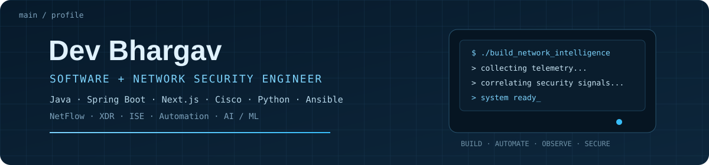

<div align="center">



## Enterprise Networking · Network Automation · Cybersecurity

I build practical systems around **Cisco networking, automation, security, and network intelligence**.

[Portfolio](https://dev-bhargav-portfolio.vercel.app/) · [LinkedIn](https://www.linkedin.com/in/devbhargav100) · [GitHub](https://github.com/majordevbhargav)

</div>

## About

I'm a networking-focused engineer interested in the space where **infrastructure, automation, security, and software** meet.

My work is mostly centered around Cisco enterprise networking, Python and Ansible automation, Cisco ISE, SD-WAN, NetFlow, endpoint posture, and experiments with AI/ML for network intelligence.

I prefer building tools that solve an actual operational problem rather than collecting technologies for the sake of a longer skills list.

## Tools I work with

| Area | Technologies |
|---|---|
| Networking | Cisco IOS / IOS XE · Routing & Switching · SD-WAN · Cisco ISE |
| Automation | Python · Netmiko · Ansible · CLI automation |
| Security | Network Security · Endpoint Posture · Identity-aware Access |
| Observability | NetFlow · Traffic Analysis · Anomaly Detection |
| Software | Java · React · APIs · Databases |
| Exploring | AI/ML · Network Intelligence · Open Source |

## Selected projects

### FlowWatch

**NetFlow-based network traffic intelligence and anomaly detection.**

FlowWatch ingests network flows and combines traffic behaviour with network context to prioritize suspicious activity. It includes traffic-only, context-aware, and risk-informed detection paths.

<div align="center">

<a href="https://github.com/majordevbhargav/FlowWatch">

</a>

</div>

[View FlowWatch →](https://github.com/majordevbhargav/FlowWatch)

> Screenshot placeholder: if the repository does not contain `assets/flowwatch-dashboard.png`, the image will not render until a dashboard screenshot is added there.

### Network Automation with Python

**Cisco network automation using Python, Netmiko and APIs.**

A collection of practical automation workflows for interacting with network devices and reducing repetitive configuration work.

<div align="center">

<a href="https://github.com/majordevbhargav/Network-Automation-With-Python">

</a>

</div>

[View Network Automation →](https://github.com/majordevbhargav/Network-Automation-With-Python)

### Posture Check

**Endpoint posture assessment and Cisco ISE session visibility.**

A practical platform combining endpoint-side checks, posture information, session monitoring, and a dashboard for network-access visibility.

[View Posture Check →](https://github.com/majordevbhargav/Posture_Check)

### Context-Aware Network Anomaly Detection

**Detect unusual network behaviour using traffic plus environmental context.**

The project explores how device identity, VLAN, role, destination familiarity and other context can make anomaly detection more useful than traffic-only models.

[View project →](https://github.com/majordevbhargav/Context-Aware-Network-Anomaly-Detection)

### Cisco XDR

**Security telemetry and threat-visibility experimentation.**

[View project →](https://github.com/majordevbhargav/Cisco-XDR)

### SD-WAN SIM

**Experiments around SD-WAN concepts, behaviour and network simulation.**

[View project →](https://github.com/majordevbhargav/SDWAN-SIM)

## Currently

- Building deeper hands-on expertise in enterprise networking and Cisco security
- Exploring AI/ML approaches for network intelligence and anomaly detection
- Learning how mature networking projects are built and maintained in open source
- Looking for opportunities to contribute to networking, Python, Ansible and cybersecurity projects

## Open source

I'm especially interested in contributing where **networking meets software**: network automation, Cisco ecosystems, Python, Ansible, observability, and defensive security.

If you're building something in that space, feel free to open an issue or discussion in the relevant repository.

## The direction

```text
Enterprise Networking
        ↓
Network Automation
        ↓
Security & Observability
        ↓
Network Intelligence
        ↓
AI / ML
```

<div align="center">

**Build it. Automate it. Observe it. Make it smarter.**

</div>
