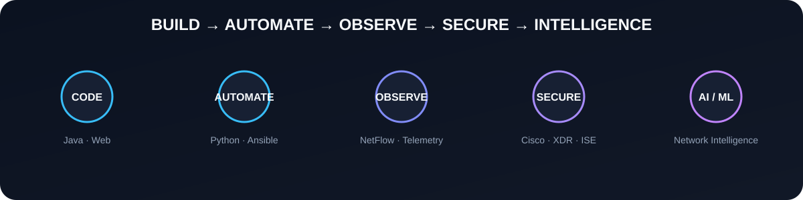
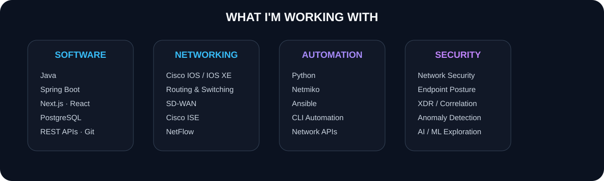

<div align="center">


## Java & Web Development · Enterprise Networking · Cybersecurity

**Building software, automating infrastructure, and turning network telemetry into security intelligence.**

[Portfolio](https://dev-bhargav-portfolio.vercel.app/) · [LinkedIn](https://www.linkedin.com/in/devbhargav100) · [GitHub](https://github.com/majordevbhargav)


</div>

---



## About Me

I'm a Computer Science engineer focused on building **practical software and infrastructure systems**.

My current work sits at the intersection of:

- **Software Development** — Java, Spring Boot, Next.js, React, PostgreSQL and REST APIs
- **Enterprise Networking** — Cisco IOS/IOS XE, routing & switching, SD-WAN, VLANs and Cisco ISE
- **Network Automation** — Python, Netmiko, Ansible and CLI/API automation
- **Security & Observability** — NetFlow, endpoint posture, anomaly detection, XDR and security telemetry
- **Network Intelligence** — experimenting with AI/ML to make network security systems more context-aware

I prefer building systems around real operational problems instead of creating projects only to demonstrate a technology.



## What I'm Working With

| Area | Current Focus |
|---|---|
| **Backend** | Java · Spring Boot · REST APIs · PostgreSQL |
| **Frontend** | Next.js · React · JavaScript · HTML · CSS |
| **Networking** | Cisco IOS / IOS XE · Routing & Switching · VLAN · STP · SD-WAN · Cisco ISE |
| **Automation** | Python · Netmiko · Ansible · CLI Automation · Network APIs |
| **Security** | Network Security · Endpoint Posture · XDR · Identity-aware Access |
| **Telemetry** | NetFlow · Traffic Analysis · Network Observability · Anomaly Detection |
| **Data / Cloud** | PostgreSQL · MongoDB · AWS · Git |
| **Learning** | AI/ML · Network Intelligence · System Design · Open Source |

## What I Want to Achieve

My long-term goal is to become a **strong software and network-security engineer** who can work across application development, infrastructure and security rather than treating them as separate domains.

### Near Term

- Strengthen **Java + Spring Boot + Next.js + PostgreSQL** for production-quality application development.
- Build deeper expertise in **Cisco enterprise networking and security**.
- Improve network automation with **Python, Netmiko and Ansible**.
- Build and document practical security tools that can be understood and reproduced by others.

### Next Stage

- Turn network telemetry into **actionable security intelligence**.
- Explore better anomaly detection using **context, identity, asset criticality and AI/ML**.
- Learn more about production architecture, distributed systems and scalable security platforms.
- Contribute to meaningful **open-source networking, automation and cybersecurity projects**.

### Long Term

```text
Software Engineering
        +
Enterprise Networking
        +
Cybersecurity
        +
Automation
        +
AI / ML
        ↓
Network Intelligence Platforms
```

I want to build systems that don't just **detect problems**, but help explain **why they matter and what should happen next**.

## Featured Projects

### 01 · Cisco XDR / XDR Hub

**Multi-source network security telemetry and incident correlation.**

XDR Hub is the current direction of my network-security work. It combines signals from **FlowWatch, Cisco ISE and Secure Network Analytics-style telemetry** to create a higher-level view of suspicious hosts and prioritize security incidents.

The goal is to move from isolated alerts toward **correlated, host-oriented security intelligence**.

[View Cisco XDR →](https://github.com/majordevbhargav/Cisco-XDR)

### 02 · FlowWatch

**NetFlow-based network traffic intelligence and anomaly detection.**

FlowWatch ingests network flows and uses multiple detection lenses instead of relying on a single model:

- **Traffic-Only** — packet, byte, duration and traffic-rate behaviour.
- **Context-Aware** — device identity, VLAN, role, destination familiarity and port-scan behaviour.
- **Risk-Informed** — anomaly signals + asset criticality → 0–100 risk score and operational tier.

It is inspired by the operational model of network-analytics platforms such as Cisco Secure Network Analytics / Stealthwatch.

[View FlowWatch →](https://github.com/majordevbhargav/FlowWatch)

### 03 · Career Match

**AI-assisted resume and job matching platform.**

A web application designed to reduce repetitive job-application work by analysing resumes, identifying skills and helping match candidates with relevant roles.

**Stack:** Java · Spring Boot · Next.js · PostgreSQL

[View Career Match →](https://github.com/majordevbhargav/career_match)

### 04 · Posture Check

**Endpoint posture assessment and Cisco ISE session visibility.**

A practical security platform combining endpoint-side posture information with network-access context and dashboard-based visibility.

[View Posture Check →](https://github.com/majordevbhargav/Posture_Check)

### 05 · Network Automation with Python

**Cisco network automation using Python, Netmiko and APIs.**

Practical automation workflows for reducing repetitive network configuration and operational tasks.

[View Network Automation →](https://github.com/majordevbhargav/Network-Automation-With-Python)

### 06 · Context-Aware Network Anomaly Detection

**Researching how network context can improve anomaly detection.**

Explores the use of device identity, VLAN, role, destination familiarity and other environmental context to make network anomaly detection more useful than traffic-only approaches.

[View project →](https://github.com/majordevbhargav/Context-Aware-Network-Anomaly-Detection)

### 07 · SD-WAN SIM

**Java-based SD-WAN behaviour and routing simulation.**

Experiments with MPLS, Broadband and LTE links, health scoring, type-based routing and z-score anomaly detection.

[View SD-WAN SIM →](https://github.com/majordevbhargav/SDWAN-SIM)

### 08 · SentinelX

**Network-security experimentation and detection concepts.**

An earlier project in my security journey that helped shape the detection ideas later developed into FlowWatch and XDR Hub.

[View SentinelX →](https://github.com/majordevbhargav/sentinelx)

## Network Automation Journey

I have explored LAN automation through several approaches, moving from direct CLI operations toward programmable and declarative automation:

```text
CLI-LAN-Automation
        ↓
LAN-Automation (Python)
        ↓
Ansible-Lan-Automation
```

- [CLI-LAN-Automation](https://github.com/majordevbhargav/CLI-LAN-Automation) — CLI-based network automation experiments.
- [LAN-Automation](https://github.com/majordevbhargav/LAN-Automation) — Python-based network automation workflows.
- [Ansible-Lan-Automation](https://github.com/majordevbhargav/Ansible-Lan-Automation) — declarative automation using Ansible.

## Other Projects & Repositories

Not every repository needs to be a flagship project. Some are learning repositories, experiments or focused implementations that document the technologies I'm working through.

| Repository | Description |
|---|---|
| [SubnetKit](https://github.com/majordevbhargav/subnet_kit) | Next.js-based IPv4 subnet/CIDR calculator, VLSM planner and IPv6 prefix calculator with visual range and bit representations. |
| [TCP-IP-Sockets](https://github.com/majordevbhargav/TCP-IP-Sockets) | Java networking experiments focused on TCP/IP socket programming and client-server communication. |
| [Core-Java](https://github.com/majordevbhargav/Core-Java) | Structured Core Java learning notes and examples covering fundamental Java concepts and OOP. |
| [Java](https://github.com/majordevbhargav/Java) | Java practice repository for learning and experimenting with Java programming concepts. |
| [Intellija-java](https://github.com/majordevbhargav/Intellija-java) | Java development and IDE-based practice projects. |
| [Javascript](https://github.com/majordevbhargav/Javascript) | JavaScript learning and practice repository. |
| [Alumni-connect](https://github.com/majordevbhargav/Alumni-connect) | Alumni networking platform with profiles, posts, groups, events, connections, messaging and role-based access. |
| [FoodieHub](https://github.com/majordevbhargav/FoodieHub) | Web application project focused on food discovery and related frontend development practice. |
| [News_app](https://github.com/majordevbhargav/News_app) | News application project for working with APIs, frontend interfaces and dynamic content. |
| [Smart_Job_Application_Website](https://github.com/majordevbhargav/Smart_Job_Application_Website) | Job-application workflow project focused on simplifying and organizing the application process. |
| [Smart_Job_Application](https://github.com/majordevbhargav/Smart_Job_Application) | Experimental smart job-application project and workflow implementation. |
| [role-match-app](https://github.com/majordevbhargav/role-match-app) | Role-matching application exploring skills-to-job matching concepts. |
| [ai-carrermatch-by-devbhargav](https://github.com/majordevbhargav/ai-carrermatch-by-devbhargav) | AI-focused Career Match experiment for resume and role analysis. |
| [pathai-by-devbhargav](https://github.com/majordevbhargav/pathai-by-devbhargav) | Earlier PathAI/Career Match prototype exploring AI-assisted career guidance. |
| [Sigma-Web-Dev-Course](https://github.com/majordevbhargav/Sigma-Web-Dev-Course) | Web-development learning repository covering practical frontend and full-stack concepts. |
| [complete-web-development-with-bootcamp](https://github.com/majordevbhargav/complete-web-development-with-bootcamp) | Web-development bootcamp practice and learning exercises. |
| [My_Portfolio](https://github.com/majordevbhargav/My_Portfolio) | Personal portfolio website and frontend presentation project. |
| [Fluid-Portfolio](https://github.com/majordevbhargav/Fluid-Portfolio) | Portfolio UI project focused on modern responsive frontend design. |
| [University_Deepcrawler](https://github.com/majordevbhargav/University_Deepcrawler) | Web-crawling/data-collection project for extracting structured university information. |
| [Japan_career_intel](https://github.com/majordevbhargav/Japan_career_intel) | Research-data project for collecting and filtering Japanese university and faculty information for career and study research. |
| [Japan_Universal_Planner](https://github.com/majordevbhargav/Japan_Universal_Planner) | Planning/research application built around organizing a Japan study and career pathway. |
| [AniJourney-AI](https://github.com/majordevbhargav/AniJourney-AI) | AI-focused project exploring creative and interactive application experiences. |
| [vibe-coding-platform](https://github.com/majordevbhargav/vibe-coding-platform) | Experiment around AI-assisted development and rapid application building. |
| [Assessment_Product_Manager](https://github.com/majordevbhargav/Assessment_Product_Manager) | Product/assessment-oriented project for exploring structured workflows and evaluation concepts. |
| [Basics](https://github.com/majordevbhargav/Basics) | Small programming fundamentals and practice repository. |

## Project Map

```text
                    DEV BHARGAV
                         │
        ┌────────────────┴────────────────┐
        │                                 │
 Software Engineering              Network Engineering
        │                                 │
 Java · Spring Boot                Cisco · SD-WAN · ISE
 Next.js · React                   NetFlow · Routing
 PostgreSQL                         Automation
        │                                 │
        └──────────────┬──────────────────┘
                       │
                 Cybersecurity
                       │
          Posture · Anomaly Detection
             XDR · Security Telemetry
                       │
                       ▼
              Network Intelligence
                       │
                    AI / ML
```

## Currently Building

- Java and Spring Boot applications with modern Next.js frontends.
- Network-security tooling around **NetFlow, Cisco ISE, endpoint posture and XDR**.
- Automation workflows using **Python, Netmiko and Ansible**.
- Detection systems that combine **traffic + identity + context + risk**.
- Practical experiments with **AI/ML for network intelligence**.

## Open Source Direction

I'm especially interested in projects where **software engineering meets networking and defensive security**.

Areas I want to contribute to:

- Network automation
- Cisco ecosystems
- Python / Java tooling
- Ansible
- Network observability
- Cybersecurity
- XDR / telemetry correlation
- AI/ML for network intelligence

## Certifications & Learning

- AWS Cloud Foundations
- Cisco Networking Basics
- Cisco Cybersecurity Essentials
- Java / Spring Boot development
- Network automation with Python, Netmiko and Ansible

## Final Direction

```text
Write Software
      ↓
Automate Infrastructure
      ↓
Collect Telemetry
      ↓
Understand Context
      ↓
Detect & Prioritize Risk
      ↓
Build Network Intelligence
```

<div align="center">

### **Build it. Automate it. Observe it. Secure it. Make it smarter.**

</div>
